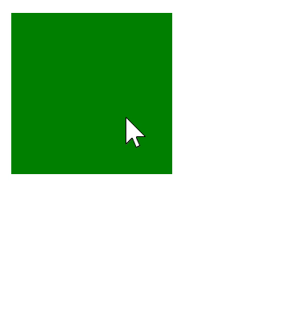

# Labb EventLyssnare
I denna laboration kommer du att arbeta med ``EventListeners`` och lära dig hur de fungerar. Målet är att skapa en enkel applikation där ett ``div``-element ändrar färg när muspekaren är över elementet och återgår till sin ursprungliga färg när muspekaren lämnar det.

## Kom Igång

1. Clona ner Övningsuppgiften.
```javascript
git clone LÄNK
```
2. installera alla node modules.
```javascript
npm i
```
3. Starta applikationen.
```javascript
npm run dev
```
4. Börja KODA!!!

### Mål / Attribute
- ``colorone`` bestämmer färgen som elementet ska ändra till när musen är över det.
- ``colortwo`` är den ursprungliga färgen på elementet som återställs när musen lämnar.

### Example



## Steg-för-steg Guide
### Steg 1 - Skapa template-filen
I ``my-div-box-template.js`` ska du skapa en template för ett ``div``-element:

- Definiera ett ``div``-element som är 100x100 px.
- Sätt ``id``-attributet till ``divBox`` för att lättare kunna identifiera elementet senare.

<details>
  <summary>Klicka för att visa koden</summary>

  ```javascript
  const template = document.createElement('template')
template.innerHTML = `
<style>
  .size {
    height: 100px;
    width: 100px;
  }
</style>
<div id="divBox" class="size"></div>
`

export { template }
  ```
</details>

### Steg 2 - Skapa webbkomponenten
I ``my-div-box.js`` ska du skapa en webbkomponent:

- Importera templaten från ``my-div-box-template.js``.
- Definiera två attribut för webbkomponenten: ``colorone`` och ``colortwo``.
  - ``colorone`` styr färgen som ``div``-elementet ska ändra till när musen är över elementet.
  - ``colortwo`` är den färg som elementet ska återgå till när muspekaren lämnar det.
- Lägg till ``EventListeners`` för musens ``mouseover`` och ``mouseleave`` för att hantera färgändringen.


<details>
  <summary>Klicka för att visa koden</summary>

  ```javascript
/**
 * Creates the custom element.
 *
 * @author Ludwig Wittenberg <lw223cq@student.lnu.se>
 * @version 1.0.0
 */

import { template } from './my-div-box-template.js'

customElements.define('my-div-box',
  /**
   * Extends the HTMLElement
   */
  class extends HTMLElement {
    #divBox
    #colorOne
    #colorTwo
    #boundDivBoxOver
    #boundDivBoxOut
    /**
     * Creates an instance of the custom element and attaches a shadow DOM.
     */
    constructor () {
      super()
      this.attachShadow({ mode: 'open' })
      this.shadowRoot.appendChild(template.content.cloneNode(true))

      this.#divBox = this.shadowRoot.querySelector('#divBox')
    }

    /**
     * Returns an array of attributes to be observed for changes.
     *
     * @returns {string[]} The list of attributes to be observed.
     */
    static get observedAttributes () {
      return ['colorone', 'colortwo']
    }

    /**
     * Called when one of the observed attributes changes.
     *
     * @param {string} name The name of the attribute that changed.
     * @param {string} oldValue The old value of the attribute.
     * @param {string} newValue The new value of the attribute.
     */
    attributeChangedCallback (name, oldValue, newValue) {
      if (name === 'colorone' && oldValue !== newValue) {
        this.#colorOne = newValue
      } else if (name === 'colortwo' && oldValue !== newValue) {
        this.#colorTwo = newValue
        this.#setColor(newValue)
      }
    }

    /**
     * Called when the element is connected to the DOM.
     */
    connectedCallback () {
      /**
       * Listens to mouse over.
       *
       * @param {Event} event - The event.
       */
      this.#divBox.addEventListener('mouseover', this.#boundDivBoxOver = (event) => {
        this.#setColor(this.#colorOne)
      })

      /**
       * Listens to mouse out.
       *
       * @param {Event} event - The event.
       */
      this.#divBox.addEventListener('mouseleave', this.#boundDivBoxOut = (event) => {
        this.#setColor(this.#colorTwo)
      })
    }

    /**
     * Called when the element is disconnected from the DOM.
     */
    disconnectedCallback () {
      this.#divBox.removeEventListener('', this.#boundDivBoxOver)
      this.#divBox.removeEventListener('', this.#boundDivBoxOut)
    }

    /**
     * Sets a new background color.
     *
     * @param {string} color - The new color.
     */
    #setColor (color) {
      this.#divBox.style.background = color
    }
  })

  ```
</details>

### Steg 3 - Importera webbkomponenten
I ``index.js`` (webcomponenten), importera webbkomponenten ``my-div-box`` så att den kan användas på sidan.

<details>
  <summary>Klicka för att visa koden</summary>

  ```javascript
import './my-div-box.js'
  ```
</details>

### Steg 4 - Använd webbkomponenten och sätt färger
I ``index.js``, skapa en instans av webbkomponenten my-div-box. Sätt attributen ``colorone`` och ``colortwo`` till valfria färger (t.ex. ``colorone="blue"`` och ``colortwo="gray"``).

<details>
  <summary>Klicka för att visa koden</summary>

  ```javascript
  import './webcomponents/my-div-box/index.js'

const myCustomElement = document.createElement('my-div-box')
myCustomElement.setAttribute('colorone', 'green')
myCustomElement.setAttribute('colortwo', 'blue')

const body = document.querySelector('body')

body.appendChild(myCustomElement)
  ```
</details>
